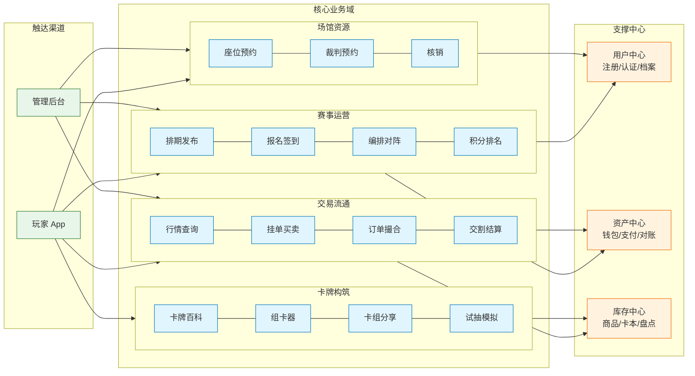
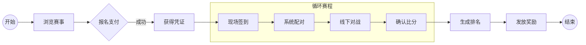
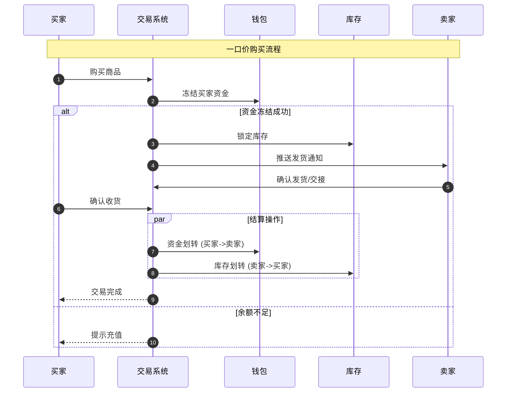

# CardArena 业务架构设计说明书

**版本**: 3.1.0 (布局优化版)  
**日期**: 2026-01-06  
**说明**: 优化图表布局，减少连线交叉，提升可读性。

---

## 1. 业务能力全景图 (Business Capability Map)

采用“分层”视图，从左至右展示用户触达、核心服务与底层支撑的关系。

---

## 2. 核心业务流程 (Key Business Processes)

### 2.1 玩家参赛流程

### 2.2 交易结算流程

---

## 3. 权限矩阵简表

| 角色 | 赛事能力 | 交易能力 | 资产能力 |
| :--- | :--- | :--- | :--- |
| **玩家** | 报名, 参赛 | 买卖, 挂单 | 充值, 提现 |
| **管理员** | **排表, 判罚** | **下架, 监管** | **退款, 对账** |
| **裁判** | 确认比分 | - | - |
