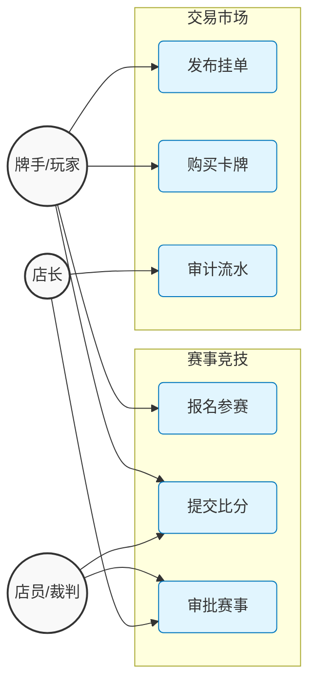

# 1. 业务全景用例图 (Use Case - Graph Style)

**版本**: 3.2.0 (一致性对齐版)  
**说明**: 每个用例均已映射到具体的 Service 方法和 DB 实体。

---

## 业务功能映射表

| Use Case | Controller / Service | Entity / Table |
| :--- | :--- | :--- |
| **报名参赛** | `TournamentService.joinTournament` | `TOURNAMENT_PARTICIPANTS` |
| **提交比分** | `TournamentService.reportMatchResult` | `MATCHES` |
| **发布挂单** | `TradeService.createListing` | `TRADE_LISTINGS` |
| **购买卡牌** | `TradeService.buyCard` | `ORDERS`, `INVENTORY` |
| **审计流水** | `TradeService.auditTransactions` | `ORDERS`, `FINANCE_LOGS` |

---

## 用例全景图

