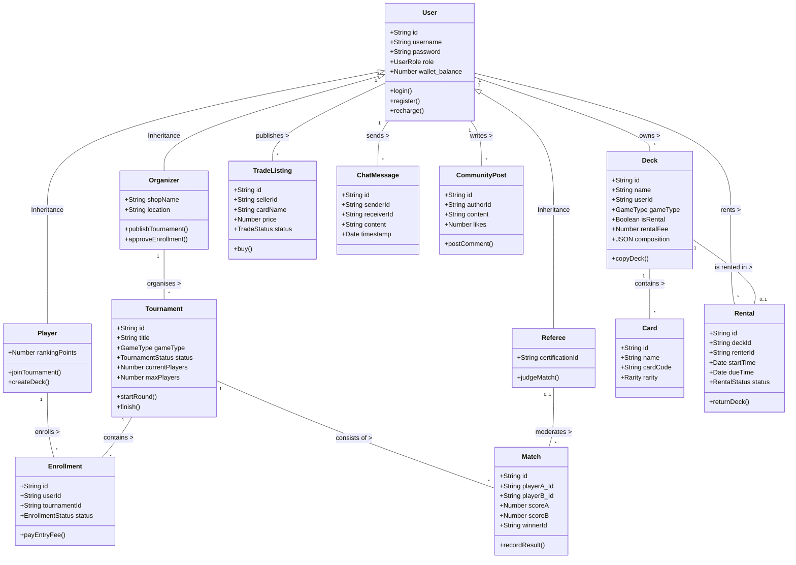

```mermaid
classDiagram
    %% --- 1. 用户模块 ---
    class User {
        +String id
        +String username
        +String password
        +UserRole role
        +Number wallet_balance
        +login()
        +register()
        +recharge()
    }

    class Organizer {
        +String shopName
        +String location
        +publishTournament()
        +approveEnrollment()
    }

    class Player {
        +Number rankingPoints
        +joinTournament()
        +createDeck()
    }
    
    class Referee {
        +String certificationId
        +judgeMatch()
    }

    User <|-- Organizer : Inheritance
    User <|-- Player : Inheritance
    User <|-- Referee : Inheritance

    %% --- 2. 赛事模块 ---
    class Tournament {
        +String id
        +String title
        +GameType gameType
        +TournamentStatus status
        +Number currentPlayers
        +Number maxPlayers
        +startRound()
        +finish()
    }

    class Enrollment {
        +String id
        +String userId
        +String tournamentId
        +EnrollmentStatus status
        +payEntryFee()
    }

    class Match {
        +String id
        +String playerA_Id
        +String playerB_Id
        +Number scoreA
        +Number scoreB
        +String winnerId
        +recordResult()
    }

    Organizer "1" -- "*" Tournament : organises >
    Player "1" -- "*" Enrollment : enrolls >
    Tournament "1" -- "*" Enrollment : contains >
    Tournament "1" -- "*" Match : consists of >
    Referee "0..1" -- "*" Match : moderates >

    %% --- 3. 卡组与资产模块 ---
    class Deck {
        +String id
        +String name
        +String userId
        +GameType gameType
        +Boolean isRental
        +Number rentalFee
        +JSON composition
        +copyDeck()
    }

    class Card {
        +String id
        +String name
        +String cardCode
        +Rarity rarity
    }

    class Rental {
        +String id
        +String deckId
        +String renterId
        +Date startTime
        +Date dueTime
        +RentalStatus status
        +returnDeck()
    }

    User "1" -- "*" Deck : owns >
    Deck "1" -- "*" Card : contains >
    User "1" -- "*" Rental : rents >
    Deck "1" -- "0..1" Rental : is rented in >

    %% --- 4. 社交与交易模块 ---
    class TradeListing {
        +String id
        +String sellerId
        +String cardName
        +Number price
        +TradeStatus status
        +buy()
    }

    class ChatMessage {
        +String id
        +String senderId
        +String receiverId
        +String content
        +Date timestamp
    }
    
    class CommunityPost {
        +String id
        +String authorId
        +String content
        +Number likes
        +postComment()
    }

    User "1" -- "*" TradeListing : publishes >
    User "1" -- "*" ChatMessage : sends >
    User "1" -- "*" CommunityPost : writes >
```