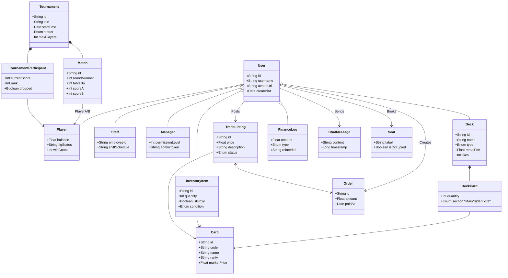
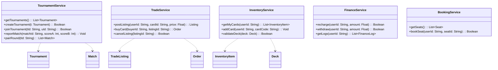

# 2. 系统静态类图 (Class Diagram - Detailed)

**版本**: 6.1.0 (字段补全版)  
**说明**: 包含类的完整属性定义与方法签名，严格遵循 UML 标准。

---

## 1. 领域实体层 (Domain Entities)

展示数据对象的内部结构。

---

## 2. 服务层 (Service Layer)

展示业务逻辑类的方法签名。

