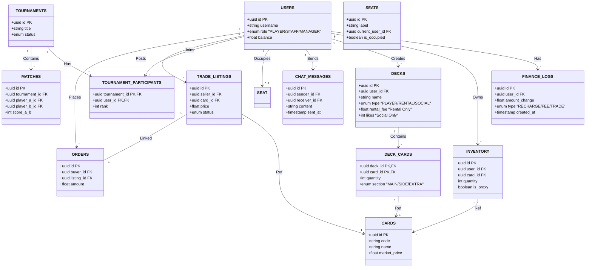

# 3. 实体关系图 (ERD - The Real Complete Version)

**版本**: 5.0.0 (全量覆盖版)  
**说明**: 包含项目中所有 11 个模型文件对应的表结构，共 **13 张表**。

---

## 数据库全表结构 (Schema)

```mermaid
classDiagram
    %% =======================
    %% 1. 用户与鉴权
    %% =======================
    class USERS {
        +uuid id PK
        +string username
        +enum role "PLAYER/STAFF/MANAGER"
        +float balance
    }

    class FINANCE_LOGS {
        +uuid id PK
        +uuid user_id FK
        +float amount_change
        +enum type "RECHARGE/FEE/TRADE"
        +timestamp created_at
    }

    %% =======================
    %% 2. 卡牌与卡组 (核心资产)
    %% =======================
    class CARDS {
        +uuid id PK
        +string code
        +string name
        +float market_price
    }

    class INVENTORY {
        +uuid id PK
        +uuid user_id FK
        +uuid card_id FK
        +int quantity
        +boolean is_proxy
    }

    class DECKS {
        +uuid id PK
        +uuid user_id FK
        +string name
        +enum type "PLAYER/RENTAL/SOCIAL"
        +float rental_fee "Rental Only"
        +int likes "Social Only"
    }

    class DECK_CARDS {
        %% 关联表：卡组包含哪些卡
        +uuid deck_id PK,FK
        +uuid card_id PK,FK
        +int quantity
        +enum section "MAIN/SIDE/EXTRA"
    }

    %% =======================
    %% 3. 赛事系统
    %% =======================
    class TOURNAMENTS {
        +uuid id PK
        +string title
        +enum status
    }

    class TOURNAMENT_PARTICIPANTS {
        +uuid tournament_id PK,FK
        +uuid user_id PK,FK
        +int rank
    }

    class MATCHES {
        +uuid id PK
        +uuid tournament_id FK
        +uuid player_a_id FK
        +uuid player_b_id FK
        +int score_a_b
    }

    %% =======================
    %% 4. 交易系统
    %% =======================
    class TRADE_LISTINGS {
        +uuid id PK
        +uuid seller_id FK
        +uuid card_id FK
        +float price
        +enum status
    }

    class ORDERS {
        +uuid id PK
        +uuid buyer_id FK
        +uuid listing_id FK
        +float amount
    }

    %% =======================
    %% 5. 辅助功能 (场馆/社交)
    %% =======================
    class SEATS {
        +uuid id PK
        +string label
        +uuid current_user_id FK
        +boolean is_occupied
    }

    class CHAT_MESSAGES {
        +uuid id PK
        +uuid sender_id FK
        +uuid receiver_id FK
        +string content
        +timestamp sent_at
    }

    %% =======================
    %% 关系连线
    %% =======================

    %% User Relations
    USERS "1" --> "*" FINANCE_LOGS : Has
    USERS "1" --> "*" INVENTORY : Owns
    USERS "1" --> "*" DECKS : Creates
    USERS "1" --> "*" CHAT_MESSAGES : Sends
    USERS "1" --> "0..1" SEAT : Occupies

    %% Deck Relations
    DECKS "1" --> "*" DECK_CARDS : Contains
    DECK_CARDS "*" --> "1" CARDS : Ref

    %% Inventory Relations
    INVENTORY "*" --> "1" CARDS : Ref

    %% Tournament Relations
    USERS "1" --> "*" TOURNAMENT_PARTICIPANTS : Joins
    TOURNAMENTS "1" --> "*" TOURNAMENT_PARTICIPANTS : Has
    TOURNAMENTS "1" --> "*" MATCHES : Contains

    %% Trade Relations
    USERS "1" --> "*" TRADE_LISTINGS : Posts
    USERS "1" --> "*" ORDERS : Places
    TRADE_LISTINGS "*" --> "1" CARDS : Ref
    TRADE_LISTINGS "1" -- "1" ORDERS : Linked
```
