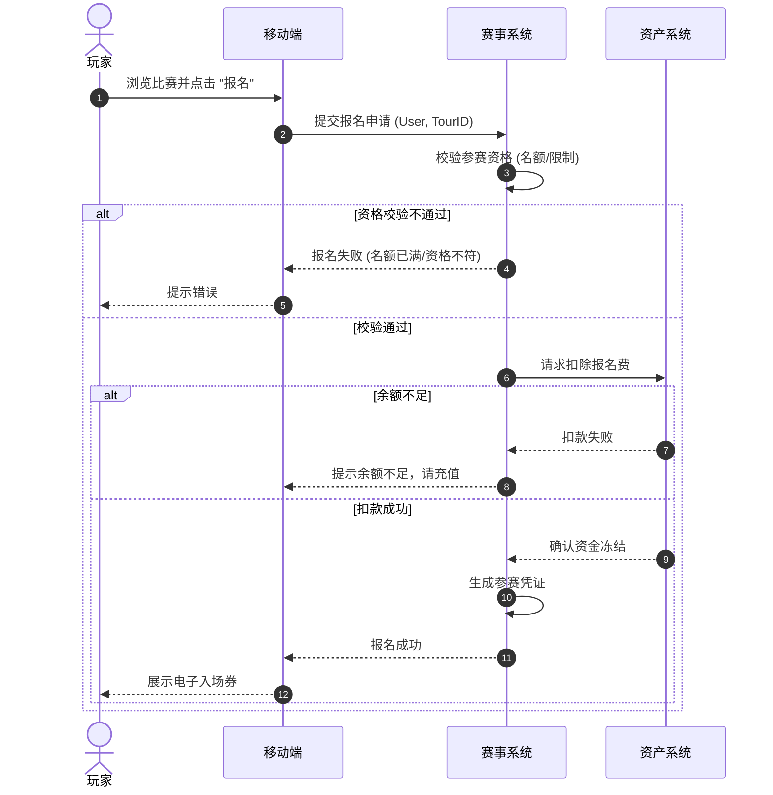
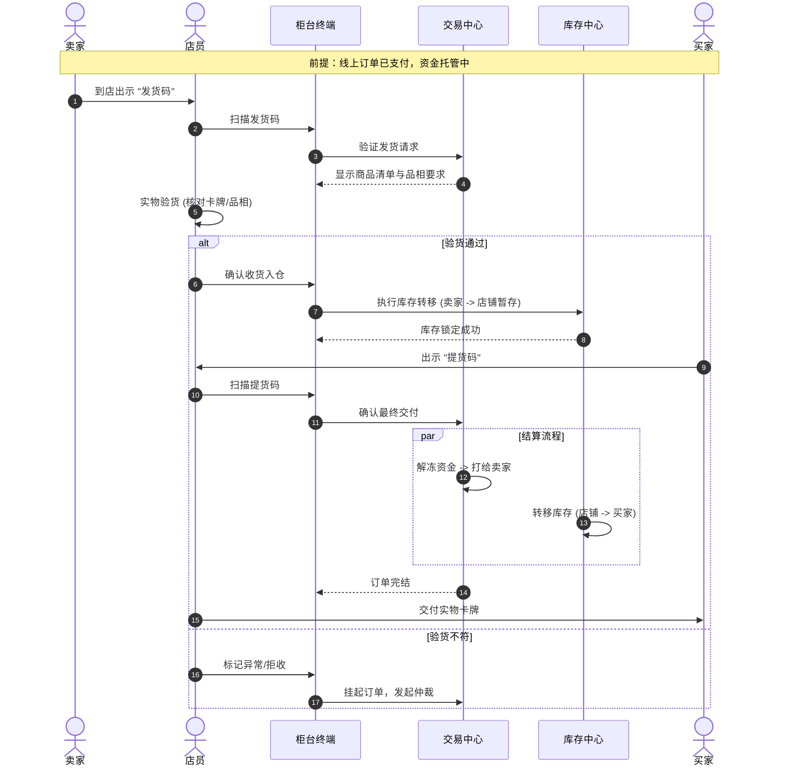
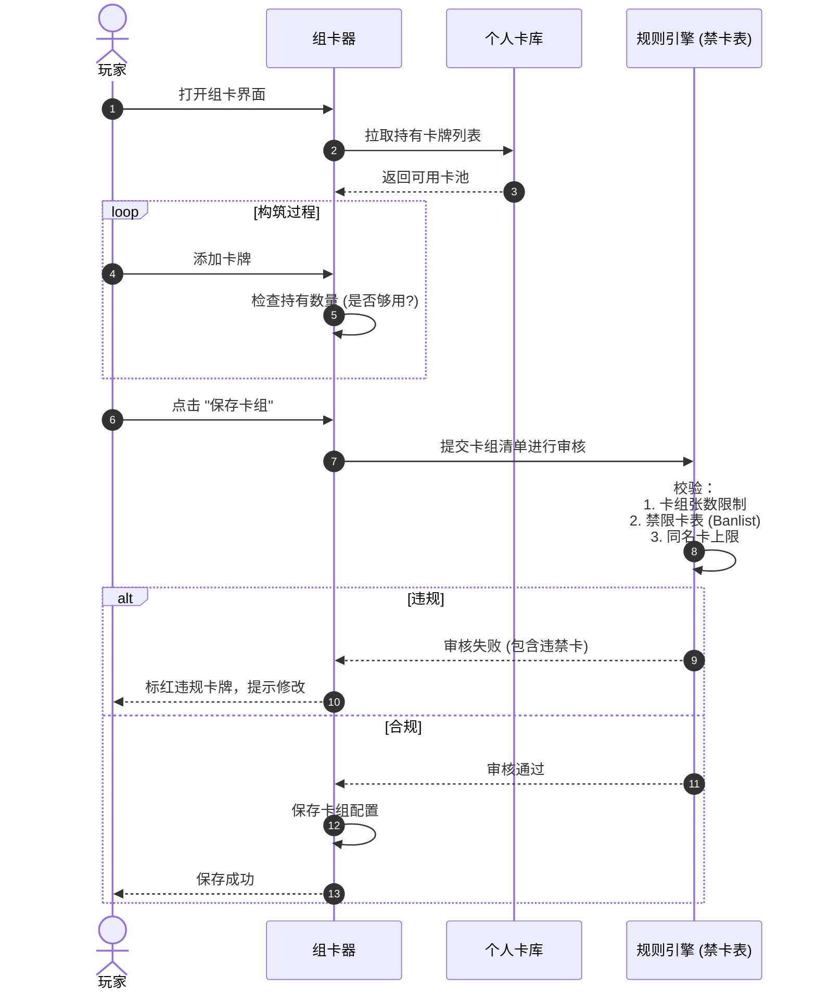
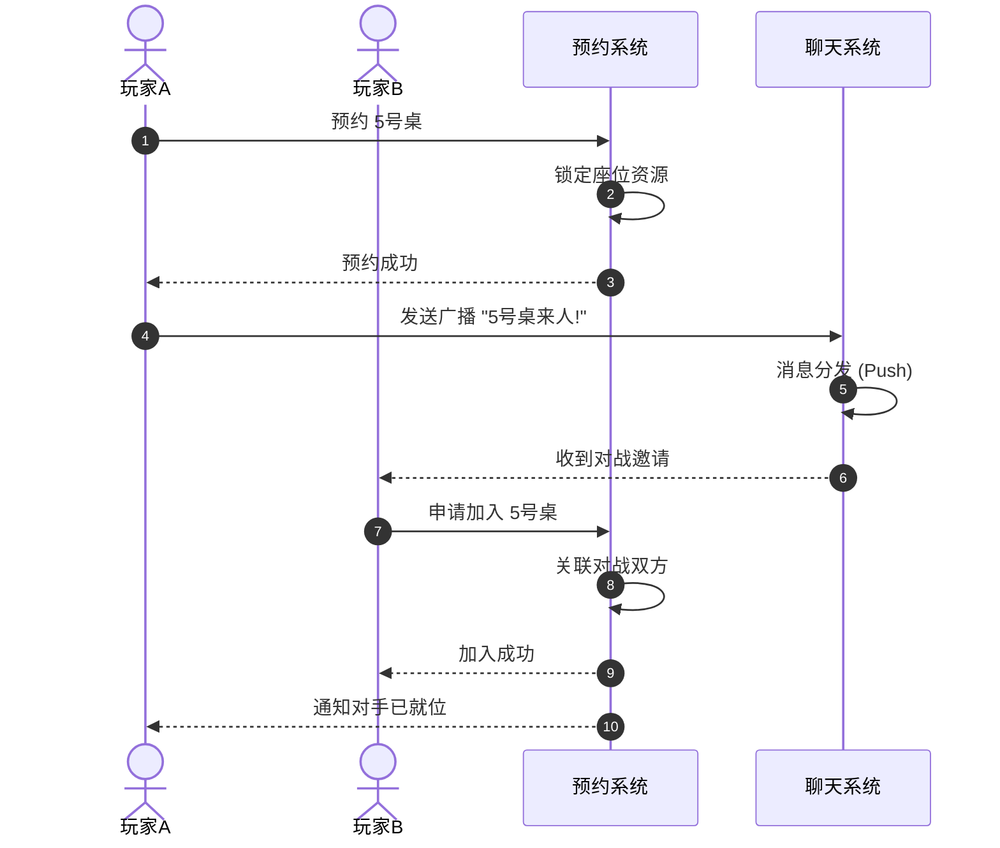

# 4. 核心业务序列图 (Business Sequence Diagram)

**版本**: 6.0.0 (纯业务版)  
**说明**: 描述业务角色与系统各功能模块之间的交互，隐藏底层技术实现细节。

---

## 场景 A: 赛事报名与资格审核 (Tournament Enrollment)

描述玩家报名参加比赛的业务流转。

---

## 场景 B: 线下交易与实物交割 (O2O Trade Fulfillment)

描述买卖双方在实体店进行卡牌交割的业务流程。

---

## 场景 C: 卡组构筑与合规性检查 (Deck Building & Compliance)

描述玩家组建套牌并接受禁卡表检查的流程。

---

## 场景 D: 社区互动与预约 (Social & Booking)

描述玩家预约座位并呼叫对手的流程。

